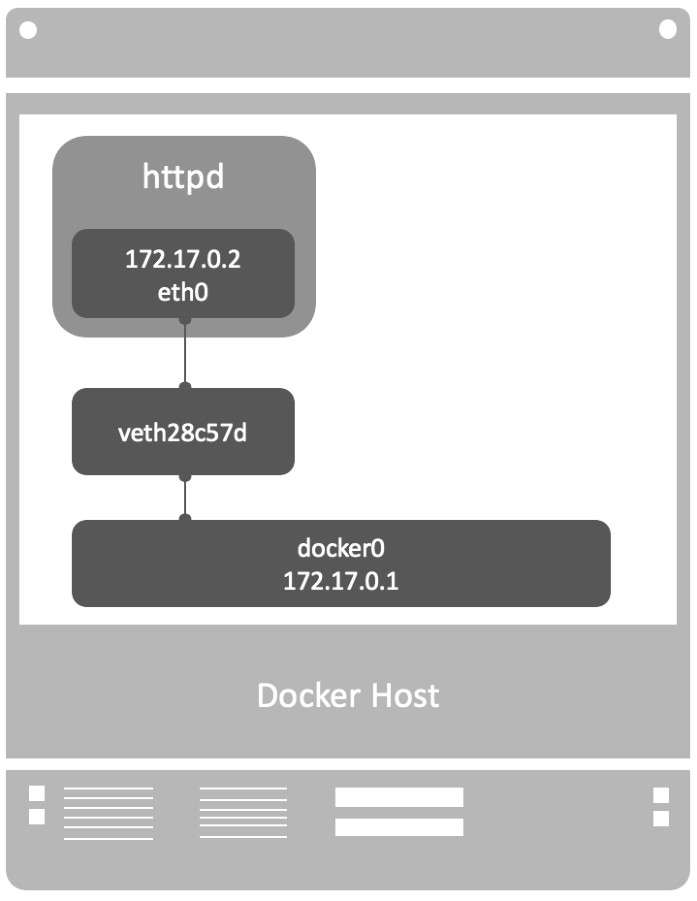
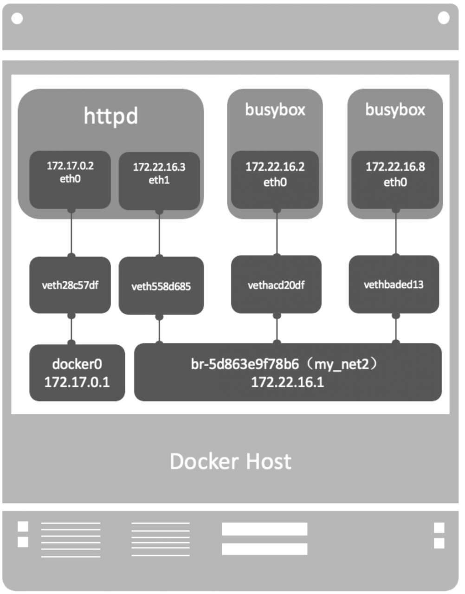

## 基础
### 什么是容器what
容器是一种轻量级、可移植、自包含的软件打包技术，开发人员将应用和环境打包在一起发布到生产系统。

容器vs虚拟机
最大区别是容器不包含整个操作系统，依然使用宿主机内核。

### 为什么要用容器
主要是为了解决部署问题，当前应用需要各种依赖库，软件包这让搭建环境变得非常复杂，需要出现一种技术让每种服务能够在所有的部署环境中顺利运行

使用容器的好处
开发：
开发人员只需为应用创建一次运行环境，然后打包成容器便可在其他机器上运行
运维：
置好标准的runtime环境，服务器就可以运行任何容器

### 容器如何工作
常见使用场景
1. 拉取基础镜像
2. 构建业务镜像
3. 运行容器
4. 访问容器
5. 创建私有Registry

## 架构
### 容器内部

可以通过 hello-world来观察

``` shell
docker pull hello-world
docker run hello-world
```
dockerfile
```
FROM scratch
COPY hello /
CMD ["/hello"]
```
### base镜像
不依赖其他镜像，从scratch构建；（2）其他镜像可以以之为基础进行扩展。

镜像采用分层结构
这样保证了有多个镜像都从相同的base镜像构建而来，那么Docker Host只需在磁盘上保存一份base镜像；同时内存中也只需加载一份base镜像，就可以为所有容器服务


### 构建镜像的方法
1. docker commit
2. dockerfile

#### docker commit
- 运行容器
- 在容器中修改将应用部署到容器中
- commit保存成新镜像


#### docker file
**FROM**
指定base镜像。
MAINTAINER
设置镜像的作者，可以是任意字符串。
**COPY**
COPY支持两种形式： COPY src dest与COPY ["src", "dest"]。
**ADD**
如果src是归档文件（tar、zip、tgz、xz等），文件会被自动解压到dest。
**ENV**
设置环境变量，环境变量可被后面的指令使用。
**EXPOSE**
指定容器中的进程会监听某个端口，Docker可以将该端口暴露出来。我们会在容器网络部分详细讨论。
**VOLUME**
将文件或目录声明为volume。我们会在容器存储部分详细讨论。
**WORKDIR**
为后面的RUN、CMD、ENTRYPOINT、ADD或COPY指令设置镜像中的当前工作目录。
**RUN**
在容器中运行指定的命令。
**CMD**
容器启动时运行指定的命令。Dockerfile中可以有多个CMD指令，但只有最后一个生效。CMD可以被docker run之后的参数替换。
**ENTRYPOINT**
Dockerfile中可以有多个ENTRYPOINT指令，但只有最后一个生效。CMD或docker run之后的参数会被当作参数传递给ENTRYPOINT。

#### RUN CMD ENTRYPOINT区别
（1）RUN：执行命令并创建新的镜像层，RUN经常用于安装软件包。
（2）CMD：设置容器启动后默认执行的命令及其参数，但CMD能够被docker run后面跟的命令行参数替换。
（3）ENTRYPOINT：配置容器启动时运行的命令。

NTRYPOINT看上去与CMD很像，它们都可以指定要执行的命令及其参数。不同的地方在于ENTRYPOINT不会被忽略，一定会被执行，即使运行docker run时指定了其他命令

### 
docker client命令

```
attach     compose    cp         exec       image      inspect    logout     node       ps         restart    save       stack      swarm      trust      volume     
build      config     create     export     images     kill       logs       pause      pull       rm         search     start      system     unpause    wait       
builder    container  diff       help       import     load       manifest   plugin     push       rmi        secret     stats      tag        update     
commit     context    events     history    info       login      network    port       rename     run        service    stop       top        version
```

### 常用命令

#### 启动容器
`docker run`
`docker run -d --restart=always httpd`
--restart=always意味着无论容器因何种原因退出（包括正常退出），都立即重启

#### 进入容器
`docker attach`
`docker exec`

attach VS exec 区别

```
（1）attach直接进入容器启动命令的终端，不会启动新的进程。
（2）exec则是在容器中打开新的终端，并且可以启动新的进程。
（3）如果想直接在终端中查看启动命令的输出，用attach；其他情况使用exec。
```


#### docker start/stop/restart xxx


docker stop命令本质上是向该进程发送一个SIGTERM信号。如果想快速停止容器，可使用docker kill命令，其作用是向容器进程发送SIGKILL信号


#### pause / unpause

1. 暂停恢复
docker pause xx
docker uppause xx

2. 删除容器/镜像
docker rm/rmi

3. 删已退出的容器
```
docker rm -v $(docker ps -a -f status=exited)
```

### 资源限制
#### 内存

> （1）-m或 --memory：设置内存的使用限额，例如100MB,2GB。

>（2）--memory-swap：设置内存+swap的使用限额。

```
    docker run -it -m 200M --memory-swap=300M progrium/stress --vm 1--
vm-bytes 280M
```
#### CPU

 > -c或 --cpu-shares设置容器使用CPU的权重

```
    docker run --name "container_A" -c 1024 ubuntu docker run --name
"container_B" -c 512 ubuntu
```
#### block IO带宽限制

> 设置 --blkio-weight参数来改变容器block IO的优先级


```
    docker run -it --name container_A --blkio-weight 600 ubuntu docker
run -it --name container_B --blkio-weight 300 ubuntu
```


### docker网络 

```
[root@TAC compose-yaml]# docker network ls
NETWORK ID          NAME                DRIVER              SCOPE
d7f83004485b        bridge              bridge              local
211abc71772f        host                host                local
b3f0f45bdef7        none                null                local

```

#### none
无网络
```
docker run -it --network=none busybox
```

#### host
连接到host网络的容器共享Docker host的网络栈，宿主机处于同一网络命名空间
```
docker run -it --network=none busybox
```


#### bridge TODO试验环境
1. Docker安装时会创建一个命名为docker0的Linux bridge
2. 创建一个容器后容器内网络会把docker0作为网关



### 自定义网络

Docker提供三种user-defined网络驱动：bridge、overlay和macvlan。overlay和macvlan用于创建跨主机的网络



### 容器间通信
#### ip通信
相同network的容器 课通过内部ip通信
#### Docker Dns Server
docker daemon实现了一个内嵌的DNS server，使容器可以直接通过“容器名”通信，只要在启动时用 --name为容器命名就可以了
#### joined容器
joined容器非常特别，它可以使两个或多个容器共享一个网络栈，共享网卡和配置信息，joined容器之间可以通过127.0.0.1直接通信